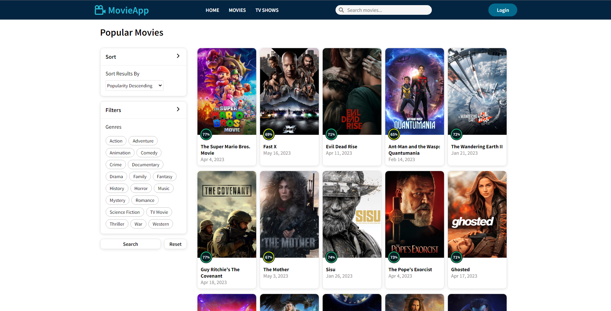

# Movie App

Check out the [Movie App web application deployed in Vercel](https://movie-app-mateober.vercel.app/home)


## Description

Movie App is a web application that allows users to search for information about movies and TV shows. It utilizes The Movie Database (TMDb) API to fetch updated movie data, such as plot details, ratings, cast, and more. Users can perform searches, view movie details, and save their favorite movies.

## Screenshots




## Features

- Search for movies and TV shows by title.
- View movie details, such as plot, rating, cast, genres, trailers, etc.
- Intuitive and user-friendly interface.
- Sort movies and TV shows by popularity, rating, release date, and title.
- Filter movies and TV shows by genres.
- Create an account and log in.
- Save favorite movies.

## Technologies Used

- HTML
- CSS
- JavaScript
- React.js
- Redux
- Axios
- React Router
- The Movie Database (TMDb) API

## Installation

1. Clone this repository to your local machine: ```git clone https://github.com/Mateober/movie-app.git```

2. Navigate to the project directory: ```cd movie-app```

3. Install the dependencies: ```npm install```

4. Rename the env.template file to .env and make the necessary changes to the environment variables:
```
VITE_API_KEY= Add your TMDb API key
VITE_API_URL= Add your database URL
```

5. Start the application: ```npm run dev```

## User Database
The user database has been developed by my colleague [Juan Manuel Gomez Omil](https://github.com/JuanchiiGomezZ). He is responsible for designing the database structure.

Features:

- Sign up (POST)
- Login (POST)
- Get user data (GET)
- Get user favorites (GET)
- Add favorite (POST)
- Remove favorite (DELETE)

[Database repository](https://github.com/JuanchiiGomezZ/FlexMoviesBackend)

## Copyright

Project created by Mateo Bertello  
[Github](https://github.com/Mateober)  
[Linkedin](https://www.linkedin.com/in/mateo-bertello/)

[The Movie Database (TMDb) API](https://www.themoviedb.org/?language=es)